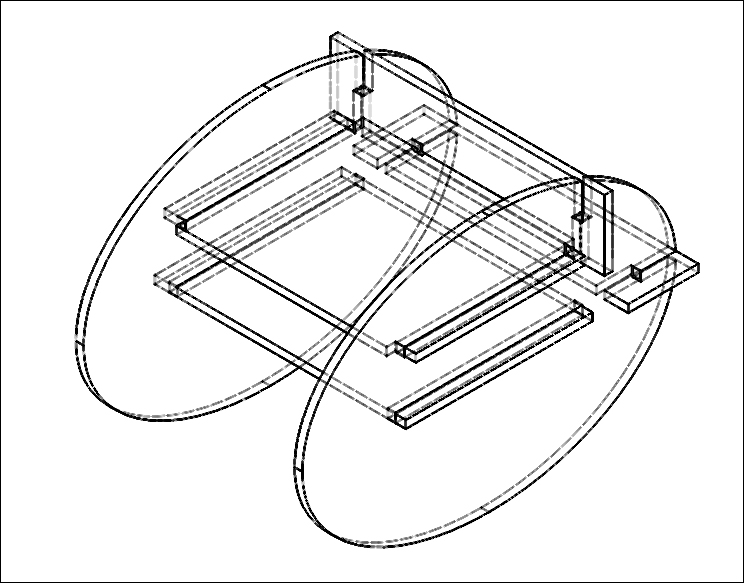
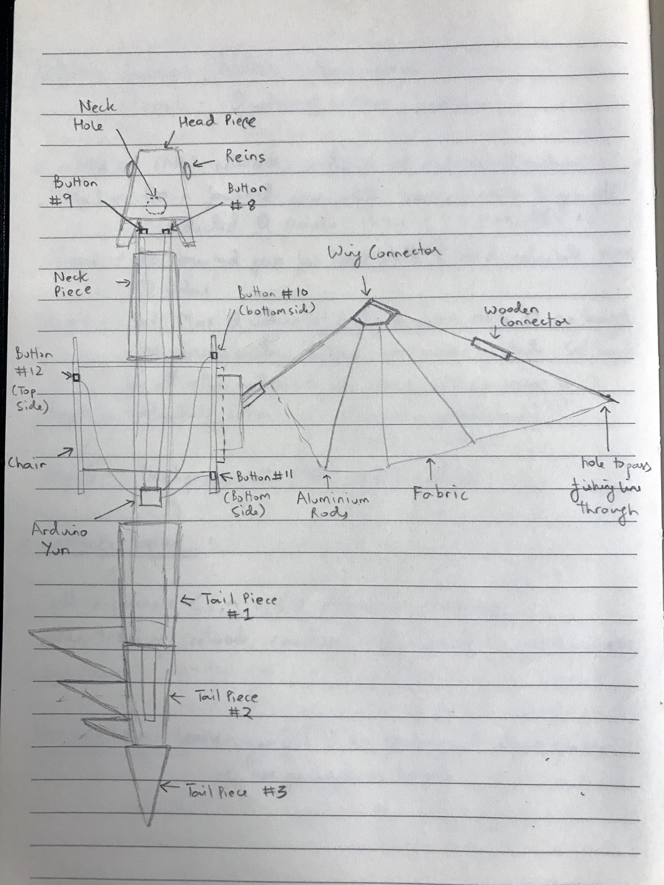

# How to Ride a Dragon VR
Dragon VR code for Children's Museum of Jordan

# Setup Steps:

## Wifi Router Setup
1. You will need a Wifi Router to create a local network. You can probably use any but I had used this [Netgear one](https://www.netgear.com/home/products/networking/wifi-routers/R7000.aspx)
2. Power on and setup your router.
3. This wifi router should not to be connected to the internet
4. You will need to connect all your devices to this router:
  1. Mac Laptop - this runs the server (socket_server)
  2. GearVR phone - this runs the dragon simulation (DragonFinalOptimizedGear)
  3. Arduino Yun - this controls the button inputs from the dragon controller (arduino/dragon_controller)
5. When a device connects to the laptop, make a note of the unique IP address that the router assigns to each device

## Server Setup:
1. This has been tested to run on a MacOS laptop
2. Install [Node](https://nodejs.org/en/download/)
3. Connect your laptop to the Wifi network of the Wifi router
4. Note down the IP address that your laptop gets assigned once it connects to this router
3. Go inside the folder socket-server in this repo
4. You can run the server from the Terminal with the command `node beep.js`

## Dragon VR Code:
1. Install [Unity 5.3.0](https://unity3d.com/get-unity/download/archive) - this is the version the code is tested in
2. Open the project from this repo titled DragonFinalOptimizedGear
3. Create a Oculus Signature File for your GearVR capable Android device [https://dashboard.oculus.com/tools/osig-generator/](https://dashboard.oculus.com/tools/osig-generator/)
4. Copy this Oculus Signature file into the Unity Project `/Plugins/Android/assets/`
5. Update IP address in the project:
  1. Select 'SocketIO' gameobject from Heirarchy Panel in Unity Project
  2. In 'Url' field in the Inspector Panel update IP address
  3. Replace `10.0.32.2` with IP address of the laptop which is connected to your wifi router e.g 192.168.1.5
  4. Leave everything else in the 'Url' field exactly the way it is, only update those 4 numbers

## Phone Setup:
1. You will need a GearVR compatible Samsung phone
2. Connect this phone to your wifi router
3. Note down the IP address that is assigned to this phone by the router

## Upload Unity Project to Phone:
1. Follow the instructions in one of these links for uploading to the GearVR phone
  1. [CGCookie](https://cgcookie.com/articles/quick-start-guide-gear-vr-unity)
  2. [Immersion](https://medium.com/immersion-for-the-win/how-to-set-up-unity-for-gear-vr-development-81615792725d)
  3. [Unity3D tutorial](https://unity3d.com/learn/tutorials/topics/virtual-reality/deploying-your-vr-project)

## Arduino Setup:
1. You will require an [Arduino Yun]
2. Download [Arduino IDE](https://www.arduino.cc/en/Main/Software)
3. Check [setup](https://www.arduino.cc/en/Guide/ArduinoYun#toc1) of Arduino 
4. Setup Arduino Yun to connect to your Wifi Router. Follow instructions [here](https://www.arduino.cc/en/Guide/ArduinoYun#toc16)
5. Open dragon_controller.ino
  1. Replace IP address `10.0.32.2` with IP address of your laptop after it has connected to your router
  2. Only replace those 4 digits, nothing else
5. Upload sketch dragon-controller from this repo to the Yun
6. The arduino requires 5 buttons plugged into it in digital pins 8,9,10,11,12
  * Pin 8 - turns dragon right
  * Pin 9 - turns dragon left
  * Pin 10 - puts dragon into a dive
  * Pin 11 - makes dragon rise up
  * Pin 12 - puts dragon into a barrel roll
7. You can see how to connect a button to the arduino [here](https://www.arduino.cc/en/Tutorial/Button)

## Starting Up:
1. Ensure all devices are connected to the local network of your wifi router
2. Make sure server is running on your laptop
3. Make sure app is installed on your mobile device. Tap the app and slide it into your GearVR headset
4. Make sure Arduino Yun is powered on, it can be plugged into a laptop or into a wall socket as long as you provide it 5V

## Dragon Assembly

1. Chair Assembly

2. Dragon Sketch

  

